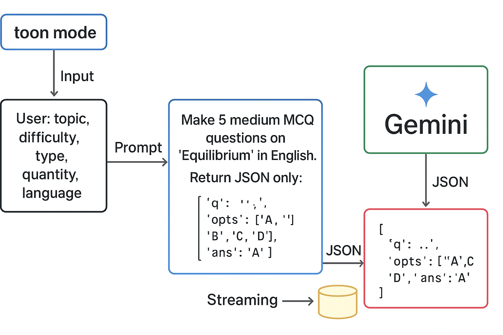

# AI Integration Guide — NoteMentor (Gemini Streaming + Toon Mode)

> Compact reference for developers: streaming generation, token-optimized prompts ("toon"), background save, and endpoints.

---

## Overview

This document explains the AI flow used by NoteMentor to generate quiz questions with Google Gemini, stream partial outputs to the client for instant UX, and persist results asynchronously to MongoDB. It includes a token-optimized "toon" prompt strategy, safe JSON parsing, and production tips.

---

## Features

* Streaming generation (real-time tokens) for low perceived latency
* Token-optimized prompts (Toon Mode) to reduce cost and latency
* Background DB insert using `process.nextTick()` or `setImmediate()`
* Unified `Question` collection with type-based subschemas (mcq / short / long)
* Lightweight auth expectations (JWT minimal)

---

## Environment & Setup

1. Create `.env` with:

```
GEMINI_API_KEY=your_key_here
MONGO_URI=mongodb://localhost:27017/notementor
JWT_SECRET=your_jwt_secret
```

2. Install dependencies:

```bash
npm install express mongoose dotenv @google/generative-ai
```

---

## Prompt Patterns

### Normal Prompt (readable)

```
Create 5 medium MCQ questions on "Photosynthesis" in English.
Return JSON array only:
[{"id":"q1","type":"mcq","question":"...","options":["..."],"correctAnswer":"...","explanation":"..."}]
```

### Toon Prompt (token-optimized)

* Short, semantic, minimal punctuation
* Use abbreviated keys to reduce tokens

```
Make 5 medium mcq Qs on "Photosynthesis" in English.
Return JSON only:
[{"q":"...","opts":["A","B","C","D"],"ans":"A"}]
```

**When to use Toon Mode:** mobile/low-cost scenarios, smaller batches, cached topics.

---

## Streaming API (controller example)

### Endpoint

`POST /api/questions/stream`

### Controller (SSE/simple stream)

```ts
// set headers for SSE
res.setHeader('Content-Type','text/event-stream');
res.setHeader('Cache-Control','no-cache');
res.flushHeaders();

await streamGenerateQuestions(userId, body, (chunk) => {
  res.write(`data: ${JSON.stringify({ chunk })}\n\n`);
});

res.write('data: [DONE]\n\n');
res.end();
```

### Client consumption (browser)

```js
const evt = new EventSource('/api/questions/stream');
evt.onmessage = (e) => { /* parse and render partial JSON tokens */ };
```

---

## Non-streaming API (fast fallback)

`POST /api/questions` — returns full JSON (useful for Postman/testing)

```ts
app.post('/api/questions', async (req,res)=>{
  const parsed = await generateQuestions(req.body); // non-streaming
  res.json(parsed);
});
```

---

## Code Snippets

### Toon-mode prompt builder

```ts
function toonPrompt({topic, difficulty, questionType, quantity, language}){
  const isMCQ = questionType==='mcq';
  return `Make ${quantity||5} ${difficulty} ${questionType} questions on "${topic}" in ${language||'English'}.\nReturn JSON only:[${isMCQ?`{"q":"...","opts":["A","B","C","D"],"ans":"A"}`:`{"q":"...","ans":"..."}`} ]`;
}
```

### Stream generator (simplified)

````ts
const model = genAI.getGenerativeModel({ model: 'gemini-2.0-flash-lite' });
const stream = await model.generateContentStream({ contents:[{role:'user', parts:[{text: prompt}]}] });
let raw='';
for await(const chunk of stream.stream){
  const text = chunk.text(); if(text){ raw+=text; onStream(text); }
}
const parsed = JSON.parse(raw.replace(/```json|```/g,''));
process.nextTick(()=> questionModel.insertMany(mapToDocs(parsed)));
````

---

## DB: Unified `Question` Collection (snippet)

```ts
const McqSchema = new Schema({ options:[{text:String}], correctAnswer:String },{_id:false});
const ShortSchema = new Schema({ expectedAnswer:String },{_id:false});
const LongSchema = new Schema({ expectedAnswer:String, wordLimit:Number },{_id:false});

const QuestionSchema = new Schema({
  creatorId:{type:Types.ObjectId, ref:'User', index:true},
  type:{type:String, enum:['mcq','short','long'], required:true},
  question:String,
  mcq:{type:McqSchema}, short:{type:ShortSchema}, long:{type:LongSchema},
  isAI:{type:Boolean, default:false}
},{timestamps:true});
```

---

## Helpers & Best Practices

* **Limit batch size**: prefer 3–5 questions per request. Generate more in parallel if needed.
* **Cache common topics** (Redis) to serve instantly.
* **Fallback**: if streaming fails, call non-stream generate and return a friendly message.
* **Validate AI JSON** before DB insert using `try { JSON.parse(...) } catch`.
* **Logging**: log TTFB and model used; rotate model if it's slow.

---

## Troubleshooting

* `404 model not found`: call ListModels or use `gemini-1.5-flash` / `gemini-2.0-flash` depending on your SDK.
* `Invalid JSON`: remove code fences from GPT, or request minimal fields.
* `High latency`: switch to `-flash` or `-lite` models, reduce tokens, or use local model.

---

## Example Request Body (Postman)

```json
{
  "topic":"Photosynthesis",
  "difficulty":"medium",
  "questionType":"mcq",
  "quantity":3,
  "quality":"high",
  "language":"English"
}
```

---


---

| Feature           | Old              | Toon Version          |
| ----------------- | ---------------- | --------------------- |
| **Prompt size**   | 300–400 tokens   | <100 tokens           |
| **Model**         | gemini-2.0-flash | gemini-2.0-flash-lite |
| **Latency**       | ~6–10s           | ~2–3s                 |
| **Cost**          | Full token count | ~65–80% cheaper       |
| **Output format** | Verbose JSON     | Minimal JSON          |

## ⚙️ Flow of Question Generation

> The following image demonstrates how the AI pipeline works from note processing to quiz creation.




## License

Copy as needed. Keep attribution to NoteMentor when reusing architecture.

*End of file*
